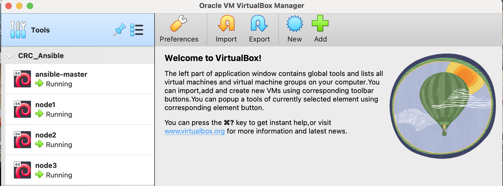

# CRC 2023 - Automatyzacja 

## Instrukcja uruchomienia środowiska laboratoryjnego

1. **Wymagane komponenty**

Komputer PC z systemem operacyjnym MS Windows 10, Apple macOS lub Linux o następujących minimalnych parametrach:

- procesor min. 4 rdzeniowy lub 2 rdzeniowy z technologią Hyper-Threading i włączoną opcją wirtualizacji w BIOS / UEFI
- min. 8 GB pamięci RAM
- min. 40 GB wolnej przestrzeni dyskowej

Dodatkowo należy pobrać i zainstalować następujące oprogramowanie:

- Vagrant - narzędzie do automatyzacji uruchamiania środowisk wirtualnych https://www.vagrantup.com/downloads
- VirtualBox - środowisko wirtualizacyjne https://www.virtualbox.org/wiki/Downloads
- Git - narzędzie do kontroli wersji plików https://git-scm.com/downloads

> Instalacja powyższych komponentów wymaga posiadania uprawnień Administratora systemu operacyjnego. 

2. **Uruchomienie środowiska laboratoryjnego**

Po instalacji wymaganego oprogramowania należy należy utworzyć katalog np. "CRC2023-Ansible", w którym będzie znajdowała się konfiguracja środowiska laboratoryjnego, następnie uruchomić terminal, przejść do utworzonego katalogu i za pomocą polecenia git zsynchronizować repozytorium wykonując następujące polecenie w terminalu:

> git clone https://github.com/piotrszewczuk/CRC_Ansible.git
 
Po zsynchronizowaniu rapozytorium należy uruchomić w terminalu następujące polecenia: 

- w systemie MS Windows
  
  ```bash
  cd c:\CRC2023-Ansible
  vagrant up
  ```
- w systemach Apple macOS i Linux
  
  ```bash
  cd ~/CRC2023-Ansible
  vagrant up
  ```
  
  Poprawne inicjalizowanie środowiska laboratoryjnego powinno zakończyć się uruchomieniem 4 maszyn wirtualnych widocznych w programie VirtualBox, tak jak na poniższym zrzucie ekranu.


